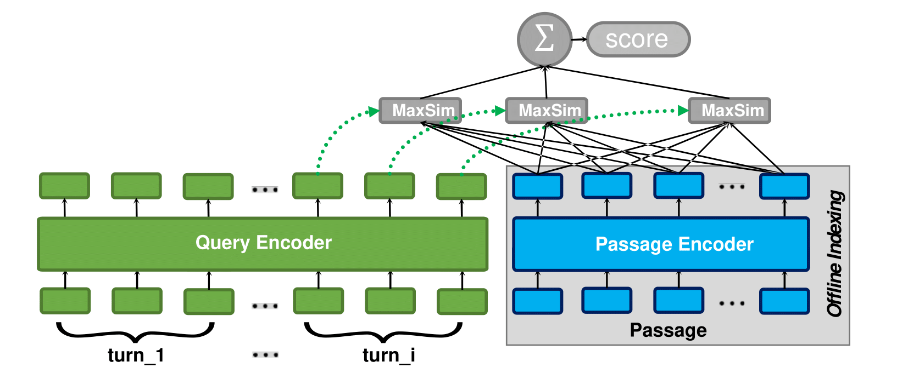

Code for reproducing the SIGIR '22 paper
# Zero-shot Query Contextualization for Conversational Search

>>>>>>> a2d4a886fc619488a5c5350dcebf702c2bb3b514
<p align="center">
  
</p>
<p align="center">
  Our approach (ZeCo<sup>2</sup>) contextualizes the last user question within the conversation history, but restrict the matching only between question and potential answer.
</p>

For more details, check our:

SIGIR'22 [poster](SIGIR_2022_poster.pdf) | [paper](https://arxiv.org/abs/2204.10613)


```
@inproceedings{krasakis-2022-zeroshot,
    author = {Krasakis, Antonios Minas and Yates, Andrew and Kanoulas, Evangelos},
    booktitle = {SIGIR 2022: 45th international ACM SIGIR Conference on Research and Development in Information Retrieval},
    month = {July},
    publisher = {ACM},
    title = {Zero-shot Query Contextualization for Conversational Search},
    year = {2022}}
```

----

## Reproducing results:

1. Install colbert 
2. Download colbert model checkpoint & update various paths (see the #TODO @ `paths.py` )
3. Corpus indexing: create FAISS indexes using a ColBERT model (see [index your collection](README_ColBERT.md#ColBERT Indexing). Note that preprocessing scripts are available in `/preprocessing`. To make use our pipeline for retrieval and evaluation, you need to convert query&passage ids to integers and retain a mapping file (`.intmapping`) before indexing (see the [preprocessing README](preprocessing/README.md) and [examples](data/collection_samples)).
4. Retrieve & rerank using the available pipeline:

`python_pipeline.py --setting ZeCo2 --dataset cast19`

### Paper analysis section:
The two scripts used to reproduce the analysis section of the paper are:

```
token_embedding_change.py
embedding_closest_terms.py
```

You can already run the analysis since the final rankings are provided under `data/rankings/`

----

For ColBERT-related questions, instructions, etc. please refer to the [original repository (forked from v0.2.0)](https://github.com/stanford-futuredata/ColBERT/tree/efaabb0f8731c7d96a9fe109a125357a9232f7a7) or `README_ColBERT.md`, or feel free to raise an issue!
